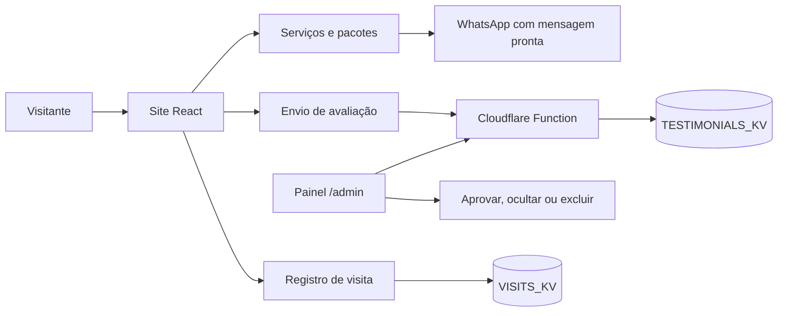

<div align="center">


# Luciane Correa Servicios

<a href="https://luciane-correa-servicios.pages.dev/">
  
</a>

**Serviços de limpeza e cuidados em Linares apresentados com clareza e contato direto pelo WhatsApp.**


[](https://github.com/xx7rg/luciane-correa-servicios/actions/workflows/ci.yml)

[**Visitar o site**](https://luciane-correa-servicios.pages.dev/)

Publicado por **x7rG ENTERPRISE™**

</div>

---

## 🏡 Sobre o projeto

O site apresenta em espanhol os serviços de **Luciane Correa** para famílias e comunidades de Linares, Jaén. Ele resolve uma necessidade prática: reunir apresentação, serviços, disponibilidade, avaliações e pedido de orçamento em uma experiência simples, principalmente para quem chega pelo celular.

A página comunica limpeza de casas e portais, passadoria, cuidado de crianças e animais, além de pacotes semanais, quinzenais e de limpeza profunda. Cada opção prepara uma mensagem específica para o WhatsApp, facilitando o primeiro contato sem obrigar o visitante a criar uma conta.

## ✨ O que a experiência oferece

- apresentação profissional, área de serviços, pacotes, processo de trabalho e perguntas frequentes;
- formulário que organiza nome, telefone, serviço e necessidade antes de abrir o WhatsApp;
- mensagens de WhatsApp adaptadas ao serviço escolhido;
- depoimentos enviados pelo público e publicados somente depois da moderação;
- painel protegido em `/admin` para aprovar, ocultar ou excluir avaliações;
- contador de visitas por país no rodapé;
- navegação responsiva, menu móvel e botão flutuante de contato.

## 🔄 Como o sistema funciona



As avaliações públicas entram como pendentes. A função só permite listar todos os registros, alterar a publicação ou excluir uma avaliação quando recebe a senha administrativa correta. O contador usa o país informado pela infraestrutura da Cloudflare e guarda apenas totais agregados por código de país.

## 🛠️ Tecnologias

| Tecnologia | Papel no projeto |
| --- | --- |
| **React 19 + TypeScript** | Interface, formulários e painel administrativo. |
| **Vite 7** | Desenvolvimento local e build de produção. |
| **Tailwind CSS 4 + CSS** | Layout, identidade visual e adaptação às telas. |
| **Wouter** | Rotas da página principal, painel e tela de erro. |
| **Cloudflare Pages Functions** | API de visitas e avaliações. |
| **Cloudflare KV** | Persistência dos contadores e depoimentos. |
| **Express** | Servidor opcional para entregar o build estático. |

## 🚀 Executar localmente

Requer **Node.js 20.19+ ou 22.12+** e **pnpm 10**.

```bash
git clone https://github.com/xx7rg/luciane-correa-servicios.git
cd luciane-correa-servicios
pnpm install
pnpm dev
```

`pnpm dev` abre a interface no endereço exibido pelo Vite. Nesse modo, as rotas `/api` da Cloudflare não são executadas.

### Testar o projeto completo

Crie `.dev.vars` na raiz para habilitar o painel administrativo local:

```dotenv
ADMIN_PASSWORD=escolha-uma-senha-local
```

Depois execute:

```bash
pnpm pages:dev
```

Esse comando gera o build e inicia o Cloudflare Pages local com as Functions e os namespaces KV em modo de desenvolvimento. O arquivo `.dev.vars` e os dados locais do Wrangler permanecem fora do Git.

| Comando | Função |
| --- | --- |
| `pnpm dev` | Inicia somente a interface com atualização automática. |
| `pnpm check` | Verifica os tipos TypeScript. |
| `pnpm build` | Gera o frontend em `dist/public` e o servidor em `dist/index.js`. |
| `pnpm preview` | Serve uma prévia do frontend já gerado. |
| `pnpm start` | Entrega o build pelo servidor Express. |
| `pnpm pages:dev` | Gera e serve a aplicação completa com Pages Functions. |
| `pnpm pages:deploy` | Gera e publica o frontend no Cloudflare Pages. |

Para publicar, autentique o Wrangler (`pnpm exec wrangler login`), configure `ADMIN_PASSWORD` como variável secreta do projeto e mantenha os bindings `TESTIMONIALS_KV` e `VISITS_KV` definidos em `wrangler.toml`.

## 📁 Estrutura principal

- [`client/src/pages/Home.tsx`](client/src/pages/Home.tsx): página pública, formulários, serviços e contato.
- [`client/src/pages/Admin.tsx`](client/src/pages/Admin.tsx): moderação das avaliações.
- [`functions/api/testimonials.ts`](functions/api/testimonials.ts): criação e administração de depoimentos.
- [`functions/api/visits.ts`](functions/api/visits.ts): contagem agregada de visitas por país.
- [`client/public/images/`](client/public/images/): logo, fotografia e imagem principal.
- [`wrangler.toml`](wrangler.toml): projeto Pages e bindings KV.

---

<p align="center">
  <strong>Cuidado, confiança e contato simples para quem precisa de ajuda em casa.</strong>
</p>

---

<div align="center">

**© 2026 x7rG ENTERPRISE™** — Todos os direitos reservados.

[](https://www.linkedin.com/in/rgds)
&nbsp;
[](https://www.instagram.com/_7ragnar/)

</div>
